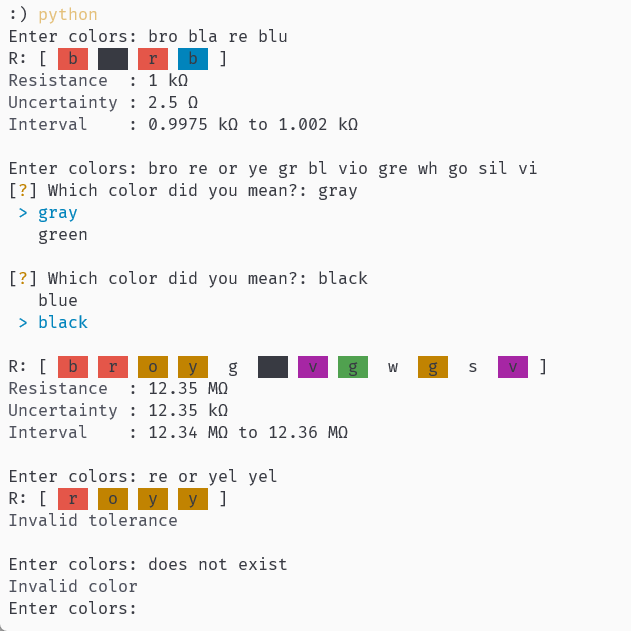

# resistance_calculator

A simple resistance calculator for carbon/film resistors.

- Trie tree is used to figure out colors in $O(\log n)$ time.
- Color highlighting is done using ANSI escape codes.
- If you have ambiguity in the color, it will ask you to choose the one you like.
- And pretty robust with some basic error handling.

- Trie to use the smallest resistor possible

## How to use

Type color code in the order of band 1, band 2, and band 3, …. it supports up to infinite bands and it always uses the last 2 bands as magnitude and tolerance.

```bash
$ pip install -r requirements.txt # install dependencies
$ python3 main.py # run the program
```

And just type your colors in. The definition and support color can be seen in the `color_value` and `tolerance_value` variable in `main.py`.

